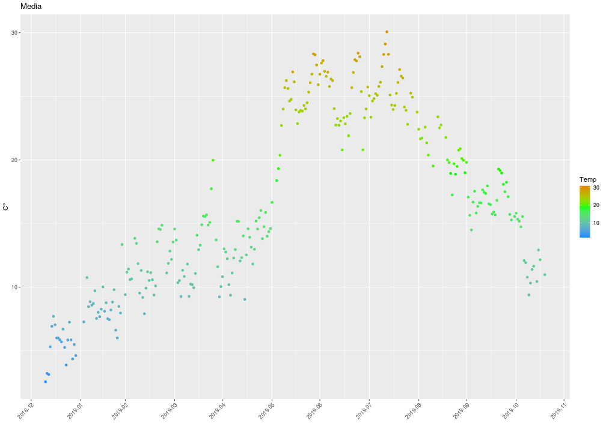
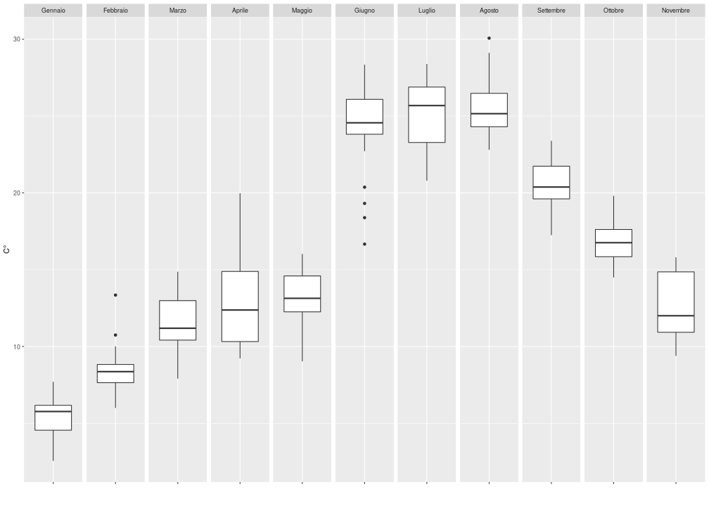
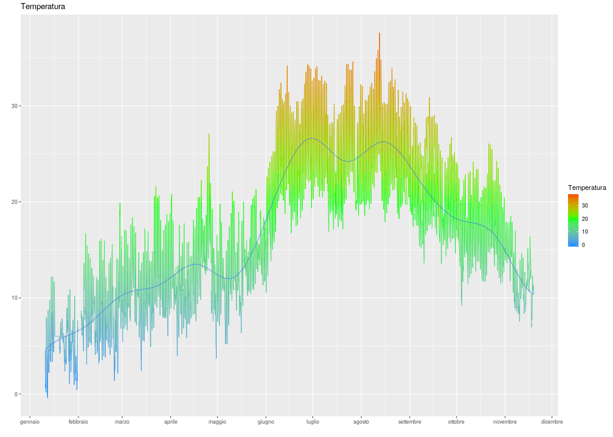
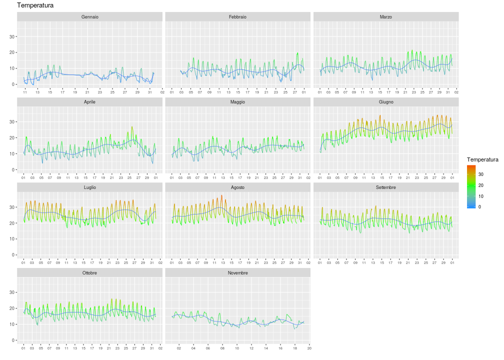

Rappresentazione grafica serie storiche
========================================================
author: Dott.ssa Arianna Orasi - Dott.Raffaele Morelli - Dott. Marco Picone
date: 
width: 1200
height: 800
font-family: 'Serif'

Librerie e caricamento dati
========================================================


```r
library(dplyr)
library(ggplot2)
library(scales)
dati2019 <- read.csv2("2019.txt", header = FALSE, sep = ",", dec = ".")

Month.labs <- c("Gennaio", "Febbraio", "Marzo", "Aprile", "Maggio", "Giugno", "Luglio", "Agosto", "Settembre", "Ottobre", "Novembre", "Dicembre")
names(Month.labs) <- c("01", "02", "03", "04", "05", "06", "07", "08", "09", "10", "11", "12")

head(dati2019)
```

```
                   V1  V2 V3 V4     V5
1 2019-01-10 18:38:37 4.6 58  0 1009.3
2 2019-01-10 18:45:01 4.5 58  0 1009.4
3 2019-01-10 19:00:01 4.6 58  0 1009.7
4 2019-01-10 19:15:01 4.3 59  0 1009.9
5 2019-01-10 19:30:01 3.9 61  0 1010.0
6 2019-01-10 19:45:01 3.6 61  0 1010.0
```

```r
str(dati2019)
```

```
'data.frame':	29944 obs. of  5 variables:
 $ V1: Factor w/ 29940 levels "2019-01-10 18:38:37",..: 1 2 3 4 5 6 7 8 9 10 ...
 $ V2: num  4.6 4.5 4.6 4.3 3.9 3.6 3.3 2.1 2.2 2.6 ...
 $ V3: int  58 58 58 59 61 61 64 69 68 65 ...
 $ V4: num  0 0 0 0 0 0 0 0 0 0 ...
 $ V5: num  1009 1009 1010 1010 1010 ...
```

Nomi variabili
========================================================

```r
colnames(dati2019) <- c("data", "temp", "hum", "prec", "press")
```

Gestione delle date
========================================================

```r
# dati2019$temp <- as.numeric(dati2019$temp)
dati2019$data <- as.POSIXct(strptime(dati2019$data, format="%Y-%m-%d %H:%M:%S"))
dati2019$day <- as.POSIXct(strptime(dati2019$data, format="%Y-%m-%d"))
dati2019$month <- format(dati2019$data, '%m')

# dati2019$day <- as.POSIXct(dati2019$day, tz = "GMT")
# detach(package:plyr)
```


Raggruppamento
=======================================================


```r
df <- dati2019 %>% 
  group_by(day, month) %>% 
  summarise(min = min(temp), 
            massima = max(temp), 
            media = mean(temp))

g <- ggplot(df, aes(day, media, color = media)) +
  geom_point(size = 1.5, na.rm = TRUE) +
  scale_x_datetime(labels = date_format("%Y-%m"), date_breaks = "1 months") +
  theme(axis.text.x = element_text(angle = 45, hjust = 1)) +
  ylab("C°") + xlab("") +
  ggtitle("Media") + labs(colour="Temp") +
  scale_colour_gradient2(low = "dodgerblue", high = "red", mid = "green", midpoint = 19)
```

=======================================================

```r
g
```




Boxplot
=======================================================

```r
ggplot(df, aes(x = "", media)) + 
  geom_boxplot() + 
  facet_grid(. ~ month, labeller = labeller(month = Month.labs)) + 
  ylab("C°") + xlab("")
```



=======================================================

```r
new2019 <- read.csv2("2019.txt", header = FALSE, sep = ",", dec = ".")

new2019$Temperatura <- as.numeric(new2019$V2)
new2019$Umidità <- as.numeric(new2019$V3)
new2019$Precipitazioni <- as.numeric(new2019$V4)
new2019$Data <- as.POSIXct(new2019$V1, format="%Y-%m-%d %H:%M:%S")

new2019$hour <- cut(new2019$Data, breaks = "hour")
```

Cut
=======================================================

```r
head(cut(new2019$Data, breaks = "hour"))
```

```
[1] 2019-01-10 18:00:00 2019-01-10 18:00:00 2019-01-10 19:00:00
[4] 2019-01-10 19:00:00 2019-01-10 19:00:00 2019-01-10 19:00:00
7500 Levels: 2019-01-10 18:00:00 2019-01-10 19:00:00 ... 2019-11-19 06:00:00
```

```r
head(cut(new2019$Data, breaks = "day"))
```

```
[1] 2019-01-10 00:00:00 2019-01-10 00:00:00 2019-01-10 00:00:00
[4] 2019-01-10 00:00:00 2019-01-10 00:00:00 2019-01-10 00:00:00
314 Levels: 2019-01-10 00:00:00 2019-01-11 00:00:00 ... 2019-11-19 00:00:00
```

```r
head(cut(new2019$Data, breaks = "month"))
```

```
[1] 2019-01-01 2019-01-01 2019-01-01 2019-01-01 2019-01-01 2019-01-01
11 Levels: 2019-01-01 2019-02-01 2019-03-01 2019-04-01 ... 2019-11-01
```


=======================================================

```r
getmeans  <- function(df) {
  c(
    Temperatura = mean(df$Temperatura), 
    Umidità = mean(df$Umidità),
    Precipitazioni = mean(df$Precipitazioni), 
    Pressione = mean(df$V5))
  }

library(plyr)
df <- ddply(new2019, .(hour), getmeans)
df$Data <- as.POSIXct(df$hour, tz = "GMT")

df$Month <- format(df$Data, '%m')
df$Day <- format(df$Data, '%d')
```

=======================================================

```r
head(df)
```

```
                 hour Temperatura Umidità Precipitazioni Pressione
1 2019-01-10 18:00:00       4.550   58.00              0  1009.350
2 2019-01-10 19:00:00       4.100   59.75              0  1009.900
3 2019-01-10 20:00:00       2.550   66.50              0  1010.675
4 2019-01-10 21:00:00       2.675   64.25              0  1011.100
5 2019-01-10 22:00:00       1.900   69.00              0  1011.475
6 2019-01-10 23:00:00       0.575   76.00              0  1011.875
                 Data Month Day
1 2019-01-10 18:00:00    01  10
2 2019-01-10 19:00:00    01  10
3 2019-01-10 20:00:00    01  10
4 2019-01-10 21:00:00    01  10
5 2019-01-10 22:00:00    01  10
6 2019-01-10 23:00:00    01  10
```

=======================================================

```r
date_format <- function(format = "%d") {
  function(x) format(x, format)
}

df$Month <- as.factor(df$Month)
```


=======================================================

```r
g <- ggplot(df, aes(Data, Temperatura, color = Temperatura)) + 
  geom_line() + 
  geom_smooth(method = lm, formula = y ~ splines::bs(x, 15), se = FALSE, size = 0.3) +
  scale_x_datetime(labels = date_format("%B"), date_breaks = "1 month") +
  scale_colour_gradient2(low = "dodgerblue", high = "red", mid = "green", midpoint = 20) +
  theme(axis.text.x = element_text(size = rel(1))) + 
  ylab("") + xlab("") +
  ggtitle("Temperatura") 
```

=======================================================

```r
g
```



Faceting
=======================================================

```r
g <- ggplot(df, aes(Data, Temperatura, color = Temperatura)) + 
  geom_line() + 
  geom_smooth(method = lm, formula = y ~ splines::bs(x, 15), se = FALSE, size = 0.3) +
  scale_x_datetime(labels = date_format("%d"), date_breaks = "2 day") +
  facet_wrap(~ Month, ncol = 3, scales = 'free_x',   labeller = labeller(Month = Month.labs)) +
  scale_colour_gradient2(low = "dodgerblue", high = "red", mid = "green", midpoint = 20) +
  theme(axis.text.x = element_text(size = rel(0.8))) + 
  ylab("") + xlab("") +
  ggtitle("Temperatura") 
```

========================================================

```r
g
```



